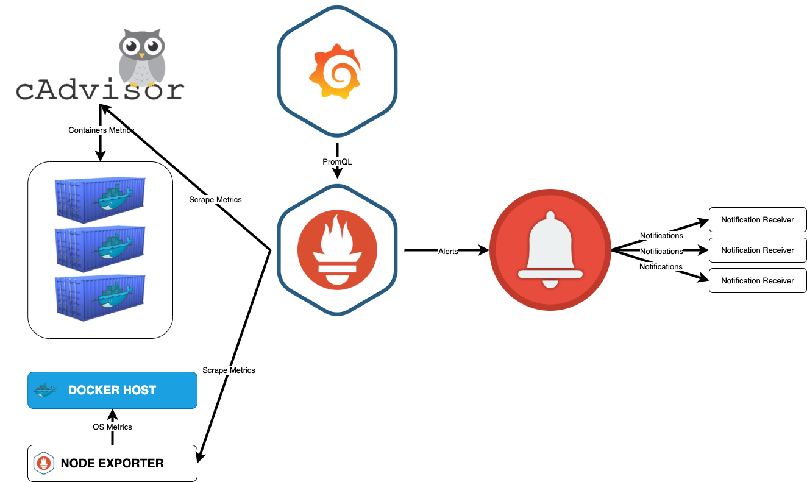
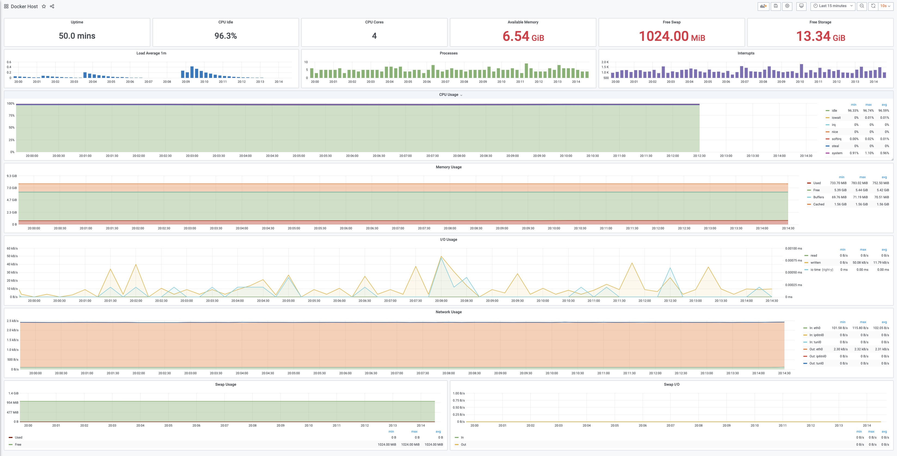
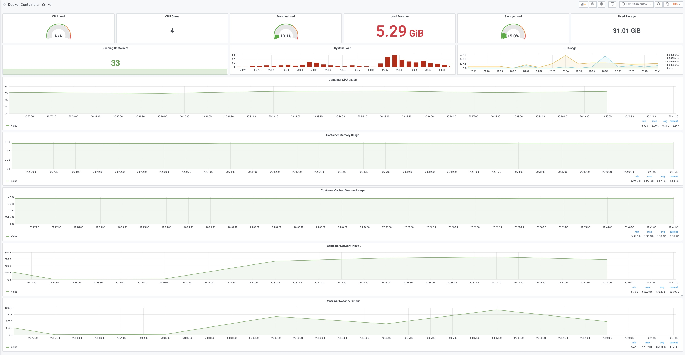
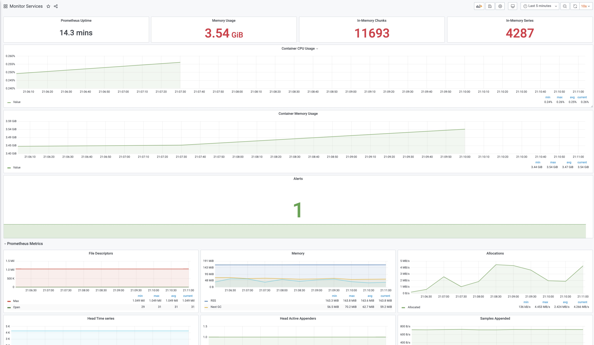
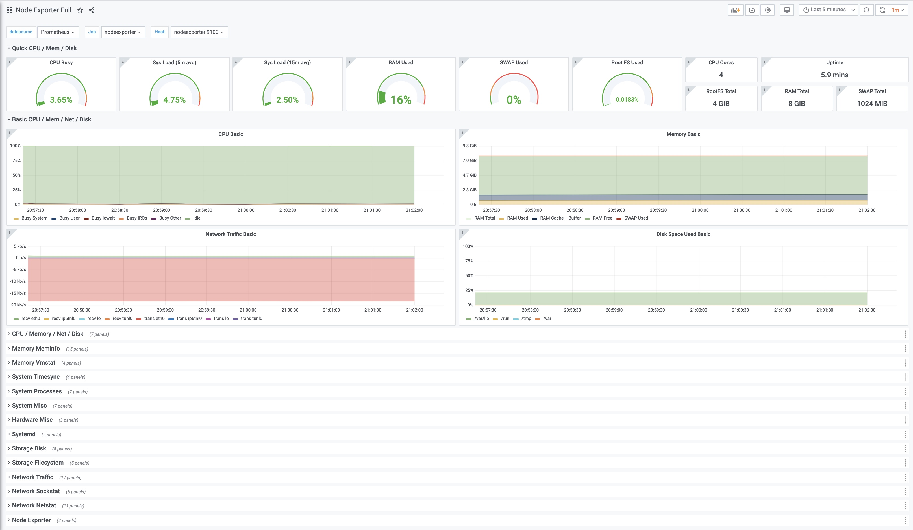

## Система мониторинга Docker-хостов и контейнеров стеком из:
- [Prometheus](https://prometheus.io/) 2.40.4, 
- [Grafana](http://grafana.org/) 9.2.6, 
- [cAdvisor](https://github.com/google/cadvisor) 0.46.0 (:exclamation: cAdvisor not working on my Apple M1 chip based Mac: [#2838](https://github.com/google/cadvisor/issues/2838), [#2763](https://github.com/google/cadvisor/issues/2763))
- [NodeExporter](https://github.com/prometheus/node_exporter) 1.4.0, 
- [Pushgateway](https://github.com/prometheus/pushgateway) 1.4.3, 
- [Caddy](https://caddyserver.com/) 2.6.2, 
- [AlertManager](https://github.com/prometheus/alertmanager) 0.24.0.


За основу взята идея Stefan Prodan [dockprom](https://github.com/stefanprodan/dockprom).

#### Почитать:

- [Collect Docker metrics with Prometheus](https://docs.docker.com/config/daemon/prometheus/)
- [Monitoring Docker container metrics using cAdvisor](https://prometheus.io/docs/guides/cadvisor/)


### Общая схема


## Установка

### Требования:

- Docker Engine >= 1.13
- Docker Compose >= 1.11

Скопировать репозиторий `dockermon` на докер-хост, перейти в директорию `dockermon` и запустить `compose up`:

    git clone https://github.com/philyuchkoff/dockermon
    cd dockermon
    ADMIN_USER=admin ADMIN_PASSWORD_HASH=JDJhJDE0JE91S1FrN0Z0VEsyWmhrQVpON1VzdHVLSDkyWHdsN0xNbEZYdnNIZm1pb2d1blg4Y09mL0ZP docker-compose up -d

**Caddy v2 не принимает пароли в plain text. Пароль ДОЛЖЕН быть предоставлен как хеш-значение. Приведенный выше хэш пароля соответствует ADMIN_PASSWORD 'admin'. Чуть ниже есть инструкция, как сгенерировать себе хэш нового пароля (раздел "Обновление Caddy до v2")**

В результате будут запущены контейнеры:

- Prometheus `http://<host-ip>:9090`
- AlertManager `http://<host-ip>:9093`
- Grafana `http://<host-ip>:3000`
- NodeExporter (сборщик метрик хостов);
- cAdvisor (сборщик метрик контейнеров).
- Caddy (reverse proxy and basic auth provider for prometheus and alertmanager)


## Обновление Caddy до v2
Выполните `docker run --rm caddy caddy hash-password --plaintext 'НОВЫЙ_ADMIN_PASSWORD'` чтобы сгенерировать хэш вашего нового пароля. 
УБЕДИТЕСЬ, что вы заменили `ADMIN_PASSWORD` новым паролем в виде обычного текста, а `ADMIN_PASSWORD_HASH` - хешем в [docker-compose.yml](docker-compose.yml) для контейнера caddy (в самом низу файла).

## Настройка Grafana

Перейдите на `http://<host-ip>:3000` и авторизуйтесь c логином `admin` и паролем `admin`. После первого входа будет предложено изменить пароль на новый. 
Учетные данные можно изменить в `docker-compose.yml` или указав переменные среды `ADMIN_USER` и `ADMIN_PASSWORD` при запуске, примерно так:

`ADMIN_USER=user ADMIN_PASSWORD=password docker-compose up -d`

Или учетные данные можно добавить непосредственно в конфиг Grafana:  
```
grafana:
  image: grafana/grafana:9.2.6
  env_file:
    - config
```
и в этом случае у файла `config` должен быть вот такой формат:
```
GF_SECURITY_ADMIN_USER=user
GF_SECURITY_ADMIN_PASSWORD=password
GF_USERS_ALLOW_SIGN_UP=false
```

Если вы решите поменять пароль, то нужно удалить вот эту строку:
```
- grafana_data:/var/lib/grafana
```
если ее не удалить - изменения не применятся, пароль не поменяется.

:exclamation: Gafana поддерживает аутентификацию, а Prometheus и AlertManager нет, то есть, доступ к Prometheus и AlertManager открыт для всех. Если это не то, что нужно - удалите expose портов Prometheus и AlertManager из `docker-compose.yml` и используйте реверс-прокси (Nginx или Caddy, например).

В Grafana предварительно уже настроены дашборды и в качестве default data source указан Prometheus. Из меню Grafana выберите `Data Sources` - `Add Data Source` и укажите контейнеры Prometheus как источник данных:

- Name: Prometheus
- Type: Prometheus
- Url: `http://prometheus:9090`
- Access: Server (default)

### Docker Host Dashboard



### Docker Containers Dashboard



### Monitor Services Dashboard


### Node Exporter Dashboard


## Alerts
В файле [alert.rules](prometheus/alert.rules) определены алармы для групп:
- Host (Docker Host)
- Prometheus (сам Prometheus)
- Containers (Docker Containers)
- Targets

Чтобы изменить/удалить/добавить правила, нужно поправить правила в указанном файле и заставить Prometheus перечитать этот файл, выполнив HTTP POST запрос в Prometheus:

    curl -X POST http://LOGIN:PASSWORD@<host-ip>:9090/-/reload
    
Работает, только если Prometheus запущен с флагом `--web.enable-lifecycle`

### Настройка
В файле [config.yml](alertmanager/config.yml) не забудьте заменить `CHANGE_TO_YOUR_TOKEN` и `CHANGE_TO_YOUR_CHAT_ID` на свои реальные значения (или настроить в этом файле нужный вам способ, если вам не нужен алертинг в Telegram). Пока вы этого не сделаете - alertmanager будет рестартиться с ошибкой:
````
msg="Loading configuration file failed" file=/etc/alertmanager/config.yml err="yaml: unmarshal errors:\n  line 21: cannot unmarshal !!str `CHANGE_...` into int64"
````

Веб-интерфейс AlertManager доступен по адресу `http://<host-ip>:9093`

AlertManager отвечает за обработку алармов, которые отправляет Prometheus, и может отправлять их в разные системы, полный список которых можно посмотреть в [документации](https://prometheus.io/docs/alerting/latest/configuration/)
Отправку нотификаций в мессенджеры, почту и т.п. можно настроить в файле [alertmanager/config.yml](alertmanager/config.yml)

## Масштабирование

- Если нужно подключить еще какие-то хосты, необходимо установить и запустить ***node-exporter*** и контейнер ***cAdvisor*** на каждом новом хосте, указать эти хосты в конфиге Prometheus и заставить Prometheus перечитать [конфиг](https://prometheus.io/docs/prometheus/latest/configuration/configuration/), выполнив HTTP POST запрос в Prometheus:

````
curl -X POST http://LOGIN:PASSWORD@<host-ip>:9090/-/reload
````
    
Работает, только если Prometheus запущен с флагом `--web.enable-lifecycle`

- В Prometheus не стоит ставить retention period большим. Если нужно хранить метрики долго - ставьте [VictoriaMetrics](https://victoriametrics.com/) (или Cortex, Thanos, M3DB...) и храните метрики там. Мне нравится VictoriaMetrics, single-node version хватит с избытком, но, если вам не хватит - у нее есть cluster version.

- Для высокодоступности и отказоустойчивости Prometheus просто поставьте два идентичных Prometheus c одинаковым конфигурационным файлом (`prometheus.yml`) на двух серверах, чтобы они собирали одни и те же метрики. При этом сервер A будет дополнительно мониторить сервер B и наоборот.

- Alertmanager может работать в кластерной конфигурации, умеет дедуплицировать данные с разных серверов Prometheus и может связываться с другими копиями Alertmanager, чтобы не отправлять несколько одинаковых оповещений. Ставьте Alertmanager на каждый сервер Prometheus.


## Планы
- :+1: Заменить Prometheus на [VictoriaMetrics](https://victoriametrics.com/)
- :+1: добавить интересный дашбоард для Prometheus Alertmanager: [Karma](https://github.com/prymitive/karma)
- нотификации от AlertManager в Telegram
- добавить [бэкапилку Prometheus TSDB](https://github.com/philyuchkoff/prometheus-tsdb-dump) (она же импортер метрик из Prometheus в VictoriaMetrics)
- добавить механизм бэкапа/восстановление Grafana, пока [скриптами](https://github.com/philyuchkoff/grafana-backup)
- добавить Missing Container Metrics https://github.com/philyuchkoff/missing-container-metrics
- ...

